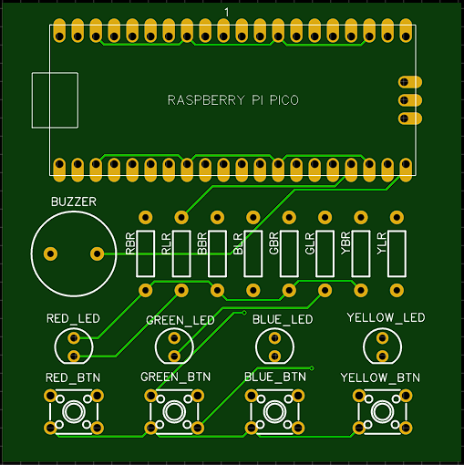
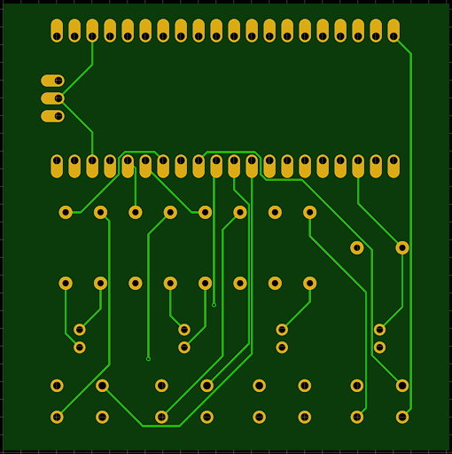

<!--
*** Thanks for checking out the Best-README-Template. If you have a suggestion
*** that would make this better, please fork the repo and create a pull request
*** or simply open an issue with the tag "enhancement".
*** Don't forget to give the project a star!
*** Thanks again! Now go create something AMAZING! :D
-->

<!-- PROJECT SHIELDS -->
<!--
*** I'm using markdown "reference style" links for readability.
*** Reference links are enclosed in brackets [ ] instead of parentheses ( ).
*** See the bottom of this document for the declaration of the reference variables
*** for contributors-url, forks-url, etc. This is an optional, concise syntax you may use.
*** https://www.markdownguide.org/basic-syntax/#reference-style-links
-->
[![Contributors][contributors-shield]][contributors-url]
[![Forks][forks-shield]][forks-url]
[![Stargazers][stars-shield]][stars-url]
[![Issues][issues-shield]][issues-url]
[![MIT License][license-shield]][license-url]
[![LinkedIn][linkedin-shield]][linkedin-url]

<!-- PROJECT LOGO -->
 

  

<h3 align="center">Memory Game</h3>

  

    A simple memory game using MicroPython and a Pi Pico
     
    <a href="https://github.com/msrogers2015/Raspberry-Pi-Zero-and-Pico-Projects"><strong>Explore the docs »</strong></a>
     
     
    <a href="https://github.com/msrogers2015/Raspberry-Pi-Zero-and-Pico-Projects">View Demo</a>
    ·
    <a href="https://github.com/msrogers2015/Raspberry-Pi-Zero-and-Pico-Projects/issues">Report Bug</a>
    ·
    <a href="https://github.com/msrogers2015/Raspberry-Pi-Zero-and-Pico-Projects/issues">Request Feature</a>
  

<!-- TABLE OF CONTENTS -->

  
Table of Contents

  <ol>
    <li>
      <a href="#about-the-project">About The Project</a>
      <ul>
        <li><a href="#built-with">Built With</a></li>
      </ul>
    </li>
    <li>
      <a href="#getting-started">Getting Started</a>
      <ul>
        <li><a href="#prerequisites">Prerequisites</a></li>
        <li><a href="#installation">Installation</a></li>
      </ul>
    </li>
    <li><a href="#usage">Usage</a></li>
    <li><a href="#roadmap">Roadmap</a></li>
    <li><a href="#contributing">Contributing</a></li>
    <li><a href="#license">License</a></li>
    <li><a href="#contact">Contact</a></li>
    <li><a href="#acknowledgments">Acknowledgments</a></li>
  </ol>

<!-- ABOUT THE PROJECT -->
## About The Project

(<a href="#top">back to top</a>)

### Built With

* [MicroPython](https://micropython.org/)
* [EasyEDA](https://easyeda.com/)
* [Raspberry Pi Pico](https://www.raspberrypi.com/products/raspberry-pi-pico/)
* [JLCPCB for Manufacturing](https://jlcpcb.com/)
* Misc. Electronics found in the BOM

(<a href="#top">back to top</a>)

<!-- GETTING STARTED -->
## Getting Started

The goal for this project is mostly soldering practice. The code is editable where you can tinker with the freqeuncy of the notes, the number of levels played, the timing, etc. Try not to change too much of the core function as that will break the game. 

### Prerequisites

* Follow along with the offical getting started guide following steps [0](https://projects.raspberrypi.org/en/projects/getting-started-with-the-pico/0) through [7](https://projects.raspberrypi.org/en/projects/getting-started-with-the-pico/7) to understand the basics of working with the raspberry pi pico.
* Have [Thonny](https://thonny.org/) installed.

### Installation

1. Build the circuit. If using a pcb, solder components to board. If using breadboard, ensure all connections are correct.
2. Open Thonny and load `main.py`
3. Plug in the Raspberry Pi Pico to your computer. If needed, flash newest firmware into the board before saving the script.
. Save `main.py` into the Raspberry Pi Pico.
4. To start the game, press the blue and yellow button at the same time. 

(<a href="#top">back to top</a>)

<!-- USAGE EXAMPLES -->
## Usage

This project is geared towards practicing soldering through-hole components into a printed circuit board. By using the printed circuit board, you are able to solidify the project and only need a small power bank such as [this one](https://www.amazon.com/Portable-Charger-Capacity-External-Indicator/dp/B08QHG1SWY/ref=sr_1_14?crid=2G9YIQGVGKIJ0&keywords=power%2Bbank&qid=1654678517&refinements=p_36%3A2491155011%2Cp_72%3A2491149011&rnid=2491147011&s=wireless&sprefix=power%2Bbank%2Caps%2C107&sr=1-14&th=1).

If you would like a challenge, try adding a little song to the end_game function or create a new function for a new game startup (flashing led patterns, sounds, etc to notify a new game is starting).

See the [open issues](https://github.com/msrogers2015/Raspberry-Pi-Zero-and-Pico-Projects/issues) for a full list of proposed features (and known issues).

(<a href="#top">back to top</a>)

<!-- LICENSE -->
## License

Distributed under the MIT License. See `LICENSE.txt` for more information.

(<a href="#top">back to top</a>)

<!-- CONTACT -->
## Contact

Marquel Rogers - [@quail_ware](https://twitter.com/@quail_ware) - mrogers@quailware.com

Project Link: [https://github.com/msrogers2015/Raspberry-Pi-Zero-and-Pico-Projects](https://github.com/msrogers2015/Raspberry-Pi-Zero-and-Pico-Projects)

(<a href="#top">back to top</a>)

<!-- ACKNOWLEDGMENTS 
## Acknowledgments

* 
* 
*  

(<a href="#top">back to top</a>)
 -->

<!-- MARKDOWN LINKS & IMAGES -->
<!-- https://www.markdownguide.org/basic-syntax/#reference-style-links -->
[contributors-shield]: https://img.shields.io/github/contributors/msrogers2015/Raspberry-Pi-Zero-and-Pico-Projects.svg?style=for-the-badge
[contributors-url]: https://github.com/msrogers2015/Raspberry-Pi-Zero-and-Pico-Projects/graphs/contributors
[forks-shield]: https://img.shields.io/github/forks/msrogers2015/Raspberry-Pi-Zero-and-Pico-Projects.svg?style=for-the-badge
[forks-url]: https://github.com/msrogers2015/Raspberry-Pi-Zero-and-Pico-Projects/network/members
[stars-shield]: https://img.shields.io/github/stars/msrogers2015/Raspberry-Pi-Zero-and-Pico-Projects.svg?style=for-the-badge
[stars-url]: https://github.com/msrogers2015/Raspberry-Pi-Zero-and-Pico-Projects/stargazers
[issues-shield]: https://img.shields.io/github/issues/msrogers2015/Raspberry-Pi-Zero-and-Pico-Projects.svg?style=for-the-badge
[issues-url]: https://github.com/msrogers2015/Raspberry-Pi-Zero-and-Pico-Projects/issues
[license-shield]: https://img.shields.io/github/license/msrogers2015/Raspberry-Pi-Zero-and-Pico-Projects.svg?style=for-the-badge
[license-url]: https://github.com/msrogers2015/Raspberry-Pi-Zero-and-Pico-Projects/blob/master/LICENSE.txt
[linkedin-shield]: https://img.shields.io/badge/-LinkedIn-black.svg?style=for-the-badge&logo=linkedin&colorB=555
[linkedin-url]: https://linkedin.com/in/marquel-rogers-a363b0191